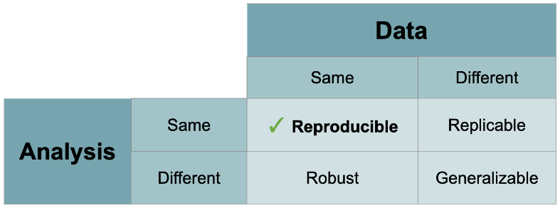

# Reproducible Research in R

## Definition



- Computational Reproducibility: Given the author’s data & statistical code, can someone produce the same results?
- Empirical Reproducibility: Is there enough information for someone else to do the study exactly the same way?

Good ==data management== is the foundation for ==reproducibility==.


## Components of Reproducibility in R

1. **Directory & Files**: Is it clear what script reads in and where it is?
2. **Script Organization**: Packages at top, comments?
3. **Script Descriptions**: Is it clear what the script does?
4. **Running the script**: Does it run?
5. **Software & Package Documentation**: What versions were used?
6. **Version Control**: Is this the actual final version?

## Tools in R Studio

`rm(list=Is())`  - clear environment at start of script
`sessionlnfo()` - reports current environment and package versions

`library(pacman)` - package loading/installing

Remove unused packages from the project maintained using `renv`:
```{r}
# Find dependencies in the current project
project_deps <- renv::dependencies()

# List all packages in the renv snapshot
snapshot_pkgs <- renv::snapshot()

# Identify unused packages
unused_pkgs <- setdiff(names(snapshot_pkgs$Packages), project_deps$Package)

# Remove unused packages from the renv library
for (pkg in unused_pkgs) {
  renv::remove(pkg)
}

renv::snapshot()
```

`papaja::apa_print()` - APA-style stats reporting
R Markdown - reporting + results woven together

- R Projects - contained wording directory & file history
- git & github - version control

## Acknowledgement

Adapted from the [2021 LATIS Reproducible Research in R Workshop](https://github.com/ajhmohr/Reproducible_Research_in_R/tree/master). 

## Relevant Resources

Data Curation