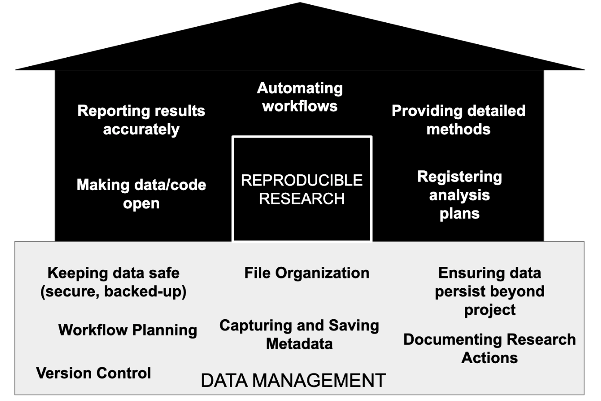

# Reproducible Research in R

**contributor**: Lingyan Yu\
**date**: 2024-04-29\
**status**: In Progress\
**version**: 0.3

## Definition of Reproducibility


-   Computational Reproducibility: Given the author’s data & statistical code,
    can someone produce the same results?
-   Empirical Reproducibility: Is there enough information for someone else to
    do the study exactly the same way?

Good **data management** is the foundation for **reproducibility**.



## Components of Reproducibility in R

1.  **Directory & Files**: Is it clear what script reads in and where it is?
2.  **Script Organization**: Packages at top, comments?
3.  **Script Descriptions**: Is it clear what the script does?
4.  **Running the script**: Does it run?
5.  **Software & Package Documentation**: What versions were used?
6.  **Version Control**: Is this the actual final version?

## [Project Management With RStudio](https://swcarpentry.github.io/r-novice-gapminder/02-project-intro.html)

-   It will help ensure the integrity of your data;
-   It makes it simpler to share your code with someone else (a labmate,
    collaborator, or supervisor);
-   It allows you to easily upload your code with your manuscript submission;
-   It makes it easier to pick the project back up after a break.

### Best practices for project organization

#### Data

-   Storing data cleaning/preprocessing scripts in a dedicated folder.
-   Treat data as read-only. Create a second folder to hold the
    cleaned/preprocessed data sets separate from the raw data

#### Outputs

-   Treat generated output as disposable $\rarr$ It should all be able to be
    regenerated from your scripts.
-   Having an output folder with different sub-directories for each separate
    analysis makes it easier later.

#### [Good Enough Practices for Scientific Computing](https://github.com/swcarpentry/good-enough-practices-in-scientific-computing/blob/gh-pages/good-enough-practices-for-scientific-computing.pdf) Recommendations:

-   Put text documents associated with the project in the `doc` directory.
-   Put raw data and metadata in the `data` directory, and files generated
    during cleanup and analysis in a `results` directory.
-   Put original source codes and scripts written for this specific project in
    the `src` (i.e., source) directory
    -   Critical for reproducibility because it ensures that all analytical
        steps can be traced and re-executed from the source code.
-   Put third-party tools, scripts, and libraries in the `bin` (i.e., binary)
    directory
    -   Critical for reproducibility by clearly delineating which tools were
        used as-is (`bin`) and which were created or modified for the project’s
        specific needs (`src`).
-   Name all files to reflect their content or function.

#### Separate function definition and application

As you build your R scripts, reusable chunks can be pulled into their own
functions. It’s a good idea to separate these functions into two separate
folders:

-   one to store useful functions that you’ll reuse across analyses and projects
-   one to store the analysis scripts

#### Additional Tips

-   **Naming Convention**: Use prefixes (like numbers) to indicate the order of
    operation if the scripts need to be run in sequence.

-   **Modular Design**: Keep scripts and functions as modular as possible. This
    means writing functions that do one thing and do it well, and scripts that
    handle a specific part of the analysis pipeline.

-   **Documentation**: Document each function and script—what they do, inputs,
    outputs, and any dependencies they have on other scripts or data sources.

## Functions

### Break programs into short single-purpose functions.

If you see blocks of similar lines of code through your current project, those
are usually candidates for being moved into functions.

For new projects, break down your problem into digestible chunks and worry about
the implementation details later. Keep breaking down the problem into manageable
small functions and build back up from there.

To source functions in analysis scripts:

``` r
source("src/functions/<function_name>.R")
```

Use `stopifnot()` to flexibly check function arguments in R.

## Data Analysis Reports with knitr

Rmd files knitted into **HTML** reports.

-   Not for traditional publication purposes, but essential throughout the life
    stage of a research project.

Benefits over R scripts, word, and LaTeX:

-   **Reproducibility**: allow easy re-compiling and integration of new data and
    corrections without manual editing of figures and results.
-   **Literate programming** with `knitr`: The integration of text and code into
    a single document, embedding results and graphs directly.
-   Continuous, scrollable format accommodating **large figures**.
-   Appropriate to its purpose $\rarr$ simpler and **less time-intensive
    formatting**

### Markdown (.md)

endash (--) vs emdash (---)

#### Maths

`$\frac{x}{y}$`$\rarr$ $\frac{x}{y}$

`$\bar{x}$` $\rarr$ $\bar{x}$

`$\sqrt{n}$` $\rarr$ $\sqrt{n}$

`superscript^2^` $\rarr$ superscript^2^

`subscript~2~` $\rarr$ subscript~2~

#### Table

| Col1 | Col2 |
|------|------|
| x1   | x2   |

Alternatively, may insert a table without manual formatting in the visual mode
of RMarkdown and Quarto files.

You can review Markdown syntax by navigating to the “Markdown Quick Reference”
under the “Help” field in the toolbar at the top of RStudio.

### R code chunks vs code blocks

Code chunks will be run when compiling; code blocks will not be run.

1.  R code chunk will be run when compiling\
    Add a new code chunk - Mod + Alt + I

    \`\`\`{r} \`\`\`

2.  R code block will not be run when compiling

    \`\`\`r \`\`\`

#### Specify chunk options to control formatting.

-   Use echo=FALSE to avoid having the code itself shown.
-   Use results="hide" to avoid having any results printed.
-   Use eval=FALSE to have the code shown but not evaluated.
-   Use warning=FALSE and message=FALSE to hide any warnings or messages
    produced.
-   Use fig.height and fig.width to control the size of the figures produced (in
    inches).

### Inline R code

-   `r function()` will be run when compiling
-   `function()` will not be run when compiling

`papaja::apa_print()` - APA-style stats reporting R Markdown - reporting +
results woven together

## Good Style

-   Comments should document **what and why**, not how.
-   Be consistent in naming, indentation, and other aspects of style.

## Acknowledgement

-   [LATIS Reproducible Research in R Workshop
    (2021)](https://github.com/ajhmohr/Reproducible_Research_in_R/tree/master)
-   [Software Carpentry - R for Reproducible Research Analysis
    (2024)](https://swcarpentry.github.io/r-novice-gapminder/)
